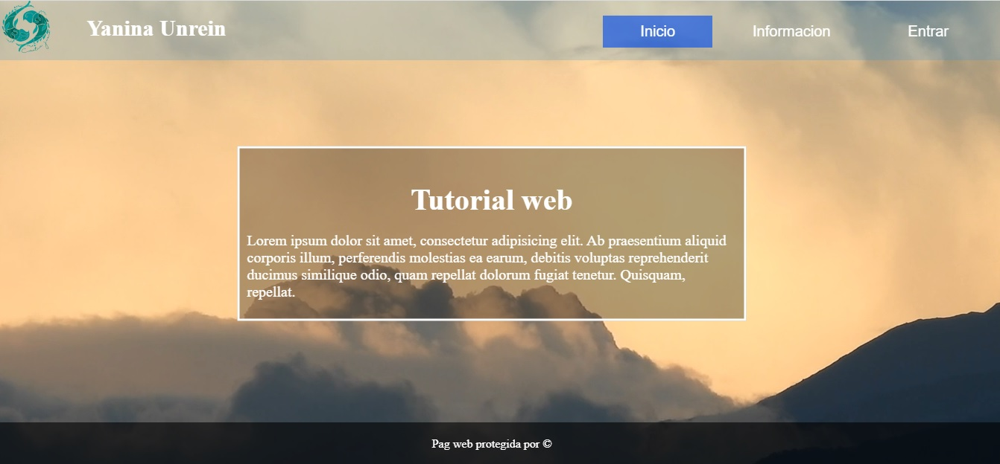
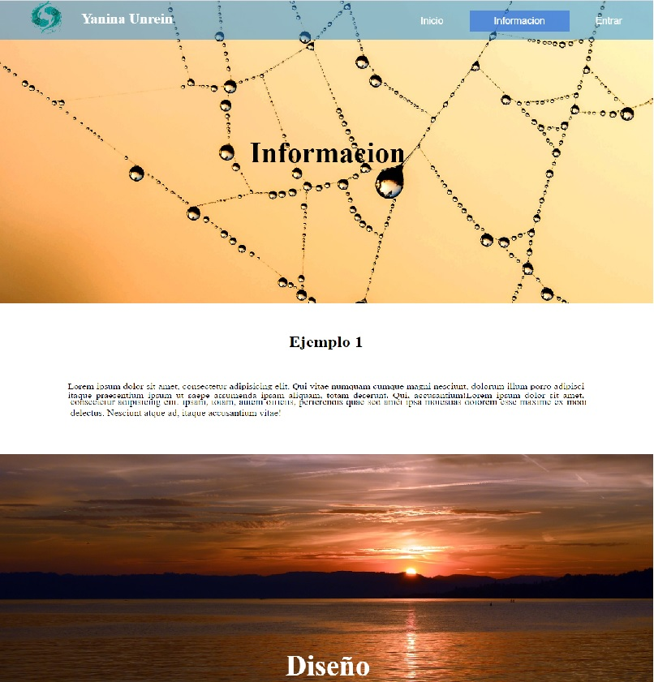
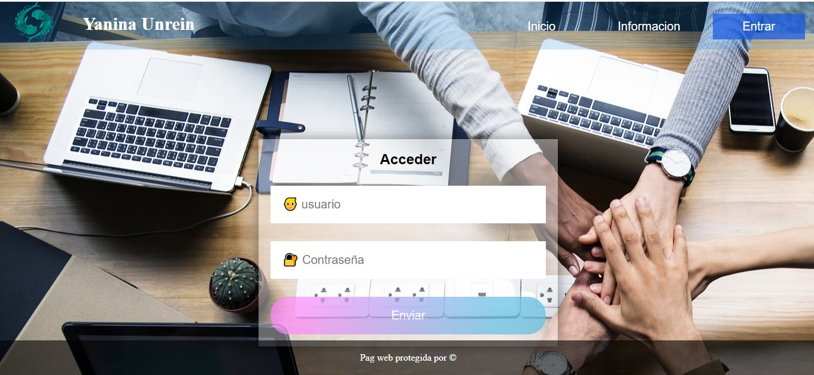

# Parallax

# Página sencilla con efecto parallax

Este es un proyecto sencillo que cree para probar el efecto parallax

### Lenguajes utilizados:

- Front End:
    + HTML 
    + CSS 
    + Javascript

# Previews

### Home page:

    </img>

### Parallax page:

    </img>

### Register page

    </img>

